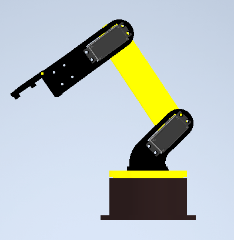
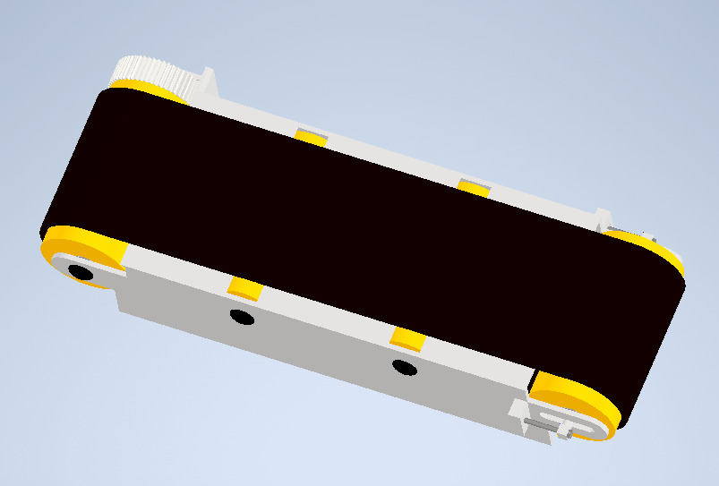
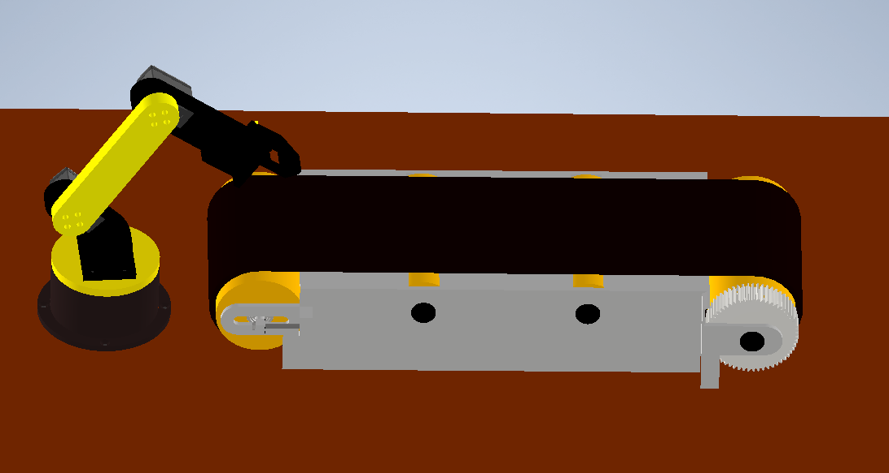

# Robot_arm

## 🚀 Introduction
In my project, I wanted to create a sort line with object detection.
## 🛠️ What I did
I used Inventor to design a line and robot arm.

I wrote a Python program to control the robot and the line.

I wrote object recognition code using TensorFlow library.

There is a camera on the line that takes photos of objects, then they are predicted and sorted into containers.

## 📷 Photos

